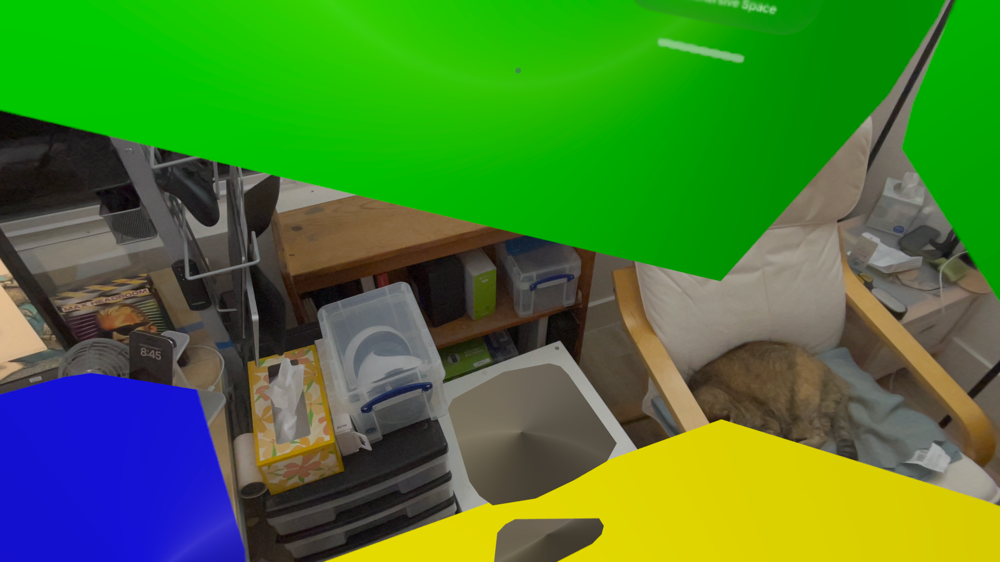

# SurfaceTest
## Use RealityKit to display the surface planes detected by ARKit

### To build
* Change the project's Development Team and Bundle Identifier
* Run
* There is no step 3!

### Legend
* Ceiling is red
* Floor is yellow
* Tables are blue
* Walls are green
* All other planes are gray

